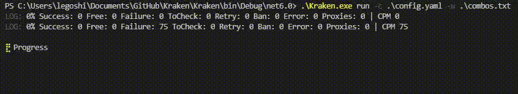

# Kraken

Kraken is a tool for brute force or credential stuffing attacks high performance



## Features
* multithreading
* proxy http, sock4 and sock5 support
* saving the progress of the checker
* automatic banning of proxies if not working or bot status ends with ban

## Getting Started

download [release](https://github.com/Meliio/Kraken/releases)
open a cmd then write "cd {path where kraken.exe is located}" then "kraken.exe --help"

### Prerequisite

[.NET Runtime 6.0.0](https://dotnet.microsoft.com/download/dotnet/6.0)


### Usage

| Flag             | Description                                                | Example                                     |
| ---------------- | ---------------------------------------------------------- | --------------------------------------------|
| -c               | yaml file of the config                                    | kraken.exe -c config.yaml                   |
| -w               | wordlist file                                              | kraken.exe -w wordlist.txt                  |
| -p               | proxies file                                               | kraken.exe -p proxies.txt http              |
| -s               | skip                                                       | kraken.exe -s 50                            |
| -b               | number of bots                                             | kraken.exe -b 10                            |
| -v               | verbose                                                    | kraken.exe -v true                          |

### Example

##### Variables

* input
* input.user
* input.pass

* response.statusCode
* response.address
* response.headers
* response.header[headerName]
* response.cookies
* response.cookie[cookieName]
* response.content

##### Request

```yaml
blocks:
  - request:
      redirect: true
      raw: |
         GET /login
         Host: example.com
         User-Agent: Mozilla/5.0 (Windows NT 10.0; Win64; x64) AppleWebKit/537.36 (KHTML, like Gecko) Chrome/80.0.3987.149 Safari/537.36
         Pragma: no-cache
         Accept: */*
      loadContent: true
```

##### Extractor

```yaml
blocks:
  - extractor:
      type: lr
      name: token
      left: ''
      right: ''
      source: <response.content>
      capture: false
```

```yaml
blocks:
  - extractor:
      type: css
      name: token
      selector: ''
      attribute: ''
      source: <response.content>
      capture: false
```

```yaml
blocks:
  - extractor:
      type: json
      name: token
      json: ''
      source: <response.content>
      capture: false
```

```yaml
blocks:
  - extractor:
      type: regex
      name: token
      regex: ''
      group: ''
      source: <response.content>
      capture: false
```

##### Keycheck

```yaml
blocks:
  - keycheck:
      keychains:
        - status: failure
          condition: or
          keys:
            - source: <response.content>
              condition: contains
              key:  ''
        - status: success
          condition: or
          keys:
            - source: <response.content>
              condition: contains
              key: ''
      banOnToCheck: true
```

```yaml
blocks:
  - keycheck:
      keychains:
        - status: free
          condition: and
          keys:
            - source: <response.content>
              condition: contains
              key:  ''
            - source: <response.content>
              condition: equals
              key:  ''
      banOnToCheck: true
```

##### Config
```yaml
settings:
  name: example
blocks:
  - request:
      raw: |
         GET https://example.com/login
         User-Agent: Mozilla/5.0 (Windows NT 10.0; Win64; x64) AppleWebKit/537.36 (KHTML, like Gecko) Chrome/80.0.3987.149 Safari/537.36
         Pragma: no-cache
         Accept: */*
  - extractor:
      type: lr
      name: token
      left: 'name=login_token value="'
      right: '"'
      source: <response.content>
      capture: false
  - request:
      raw: |
         POST https://example.com/login
         User-Agent: Mozilla/5.0 (Windows NT 10.0; Win64; x64) AppleWebKit/537.36 (KHTML, like Gecko) Chrome/80.0.3987.149 Safari/537.36
         Pragma: no-cache
         Accept: */*
         
         username=<input.username>&password=<input.password>&token=<token>
  - keycheck:
      keychains:
        - status: failure
          condition: or
          keys:
            - source: <response.content>
              condition: contains
              key:  IDENT_KO
        - status: success
          condition: or
          keys:
            - source: <response.content>
              condition: contains
              key: AUTH_OK
      banOnToCheck: true
```
[tip use yaml formatter](https://jsonformatter.org/yaml-formatter)

### Debug

